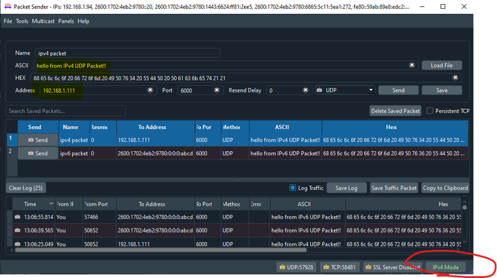
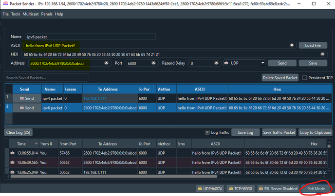

# STM32-Hotspot/Dual IPv4 and IPv6 UDP with NetXDuo on NULCEO-H743

## Example

This Hotspot FW package includes:
* An example of receiving UDP messages using both IPv4 and IPv6 addressing
  * Receives UDP messages from the network and prints them on Virtual COM Port
  * Project was created using CubeMX, allowing for better understanding of creating custom projects from scratch
  * Demonstrates enabling and using IPv6, which is not generated by CubeMX by default

## Board Needed

  * [NUCLEO-H743](https://www.st.com/en/evaluation-tools/nucleo-h743zi.html)

## Users Guide

### Running the application
  * Connect the NUCLEO to a PC using a USB cable
  * Open the project in STM32CubeIDE
  * Build the project.
  * Load the firmware into target memory.

### Testing UDP

  * You will need a serial terminal program to connect the ST Link virtual COM port on the board. Baud Rate: 115200. I use Tera Term
  * You will also need to have some way of sending UDP packets, preferably one that supports both IPv4 and IPv6, I use Packet Sender.
    * [Packet Sender](https://packetsender.com/)

        
        
  * Plug STM32 board into a router connected to your local network. 
  * **PLEASE NOTE** you may need to change the IPv4 and IPv6 address of the device based on valid subnet address for your given router. 
    * The IPv4 address can be changed in app_netxduo.h using the define below: 
        #define NX_APP_DEFAULT_IP_ADDRESS                   IP_ADDRESS(192, 168, 1, 111)

    * The IPv6 address can be changed in the file app_netxduo.c near line 227, where the variable ipv6_address is assigned an address

    * The UDP port can be changed in app_netxduo.c on line 300, second argument of the function 
        /* Bind to port 6000 */
	    ret = nx_udp_socket_bind(&UDPSocket, 6000, TX_WAIT_FOREVER);

  * When the firmware executes after reset, it will print to the terminal it's IPv4 and IPv6 addresses, along with the UDP port it is binded to. By default, this will be port 6000
  * With the board plugged into the router with valid IP address, you should be able to send UDP messages to devices IP address on port 6000 from any devices on your router network. The messages will be printed on the serial terminal.

## Troubleshooting

**Caution** : Issues and the pull-requests are **not supported** to submit problems or suggestions related to the software delivered in this repository. The Dual IPv4 and IPv6 UDP with NetXDuo on NULCEO-H743 example is being delivered as-is, and not necessarily supported by ST.

**For any other question** related to the product, the hardware performance or characteristics, the tools, the environment, you can submit it to the **ST Community** on the STM32 MCUs related [page](https://community.st.com/s/topic/0TO0X000000BSqSWAW/stm32-mcus).